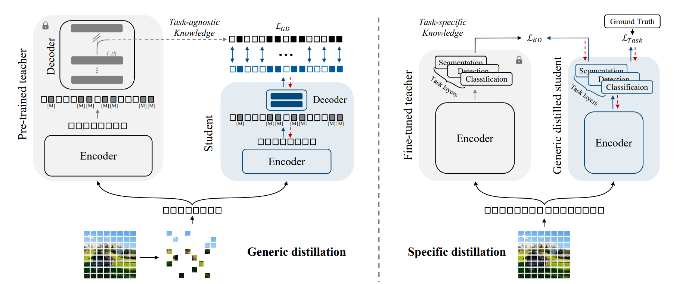

# Generic-to-Specific Distillation of Masked Autoencoders, CVPR 2023 

🔥 **Accepted by CVPR 2023!**

## Introduction

Large vision Transformers (ViTs) driven by self-supervised pre-training mechanisms  achieved unprecedented progress. Lightweight ViT models limited by the model capacity, however, benefit little from those pre-training mechanisms. Knowledge distillation defines a paradigm to transfer representations from large (teacher) models to small (student) ones. However, the conventional single-stage distillation easily gets stuck on task-specific transfer, failing to retain the task-agnostic knowledge crucial for model generalization. In this study, we propose generic-to-specific distillation (G2SD), to tap the potential of small ViT models under the supervision of large models pre-trained by masked autoencoders. In generic distillation, decoder of the small model is encouraged to align feature predictions with hidden representations of the large model, so that task-agnostic knowledge can be transferred. In specific distillation, predictions of the small model are constrained to be consistent with those of the large model, to transfer task-specific features which guarantee task performance. With G2SD, the vanilla ViT-Small model respectively achieves 98.7%, 98.1% and 99.3% the performance of its teacher (ViT-Base) for image classification, object detection, and semantic segmentation, setting a solid baseline for two-stage vision distillation. 

## Model weights and logs

You could download model weights and logs here: [Google drive](https://drive.google.com/drive/folders/1ogaHzTrqlirBMaZ-Ssa4gNG6zp1Hsn1g?usp=sharing).

